# CodeAnt AI vs Claude Code

**Comprehensive Comparison for Production-Ready Code Review**

**Evidence-Based Analysis**

---

## Executive Summary

Following a comprehensive analysis of both CodeAnt AI and Claude Code through practical implementation and testing, this document presents evidence-based findings across multiple dimensions of automated code review.

### Critical Incident Background

This comparison was initiated following a costly production failure that resulted in **$100,000 in penalties** and damaged client confidence. When the problematic code was manually reviewed by AI, the issues were immediately caught - highlighting the critical need for automated integration into the development workflow.

### Document Structure

This comprehensive analysis includes:

- 24+ screenshots of evidence across 5 key categories
- Side-by-side feature comparison analysis
- Detailed evaluation of production readiness
- Security and compliance assessment
- Implementation quality comparison

---

## 1. PR Review Quality Comparison

This section compares how both tools review pull requests, analyze code quality, and provide actionable feedback.

### 1.1 CodeAnt AI: Dashboard-Based Review

CodeAnt AI provides a comprehensive dashboard with issue detection but requires manual intervention for implementation.

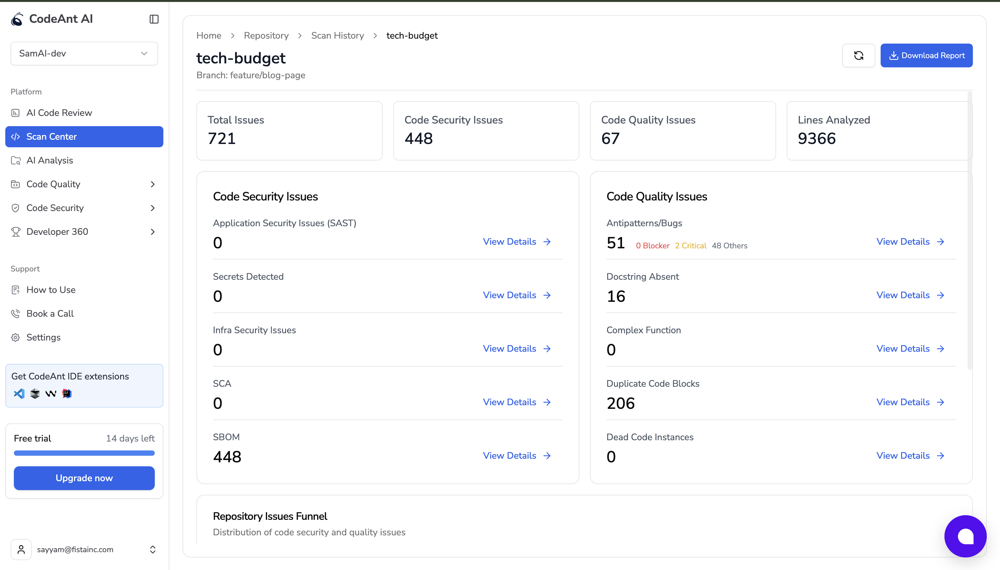

*Screenshot shows: Dashboard interface with issue counts and severity levels*

*Screenshot shows: Detailed view of detected issues with severity classifications*

### 1.2 Claude Code: Implementation-Focused Review

Claude Code provides actionable code implementations directly in PR comments, ready for production use.

*Screenshot shows: Claude's detailed code review with implementation suggestions*

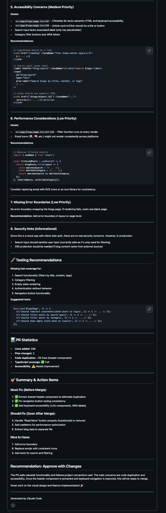

*Screenshot shows: Additional Claude PR review details*

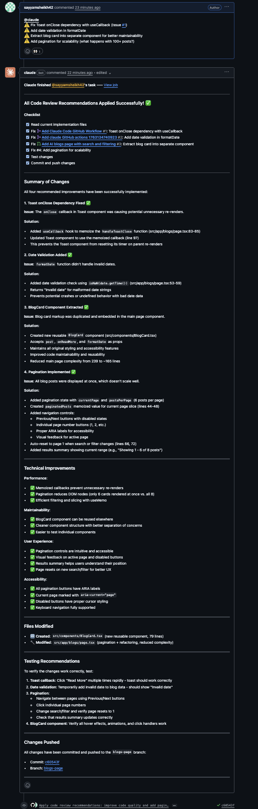

*Screenshot shows: Production-ready code with proper error handling and security*

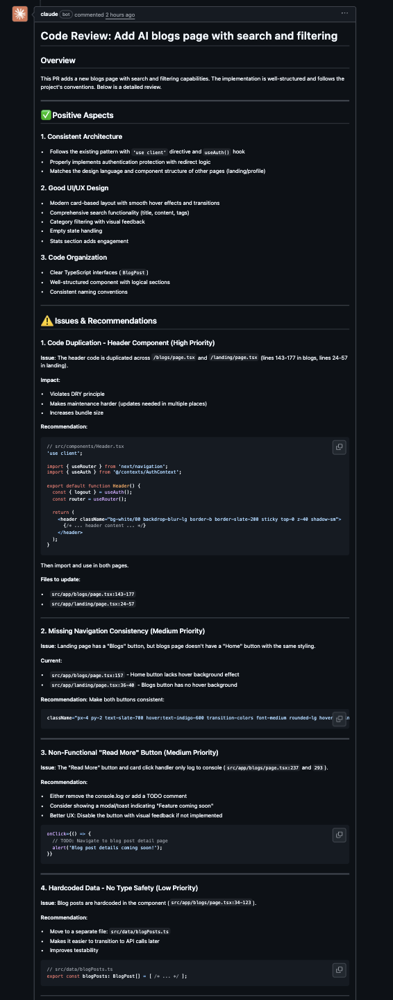

*Screenshot shows: Detailed explanations with evidence and reasoning*

### 1.3 Key Findings: PR Review Quality

- **CodeAnt AI**: Detects issues but provides limited actionable solutions
- **Claude Code**: Delivers production-ready implementations with comprehensive explanations

**Winner: Claude Code** for actionable, production-ready code

---

## 2. Security Analysis

Comparing security vulnerability detection, compliance checking, and secure coding practices.

### 2.1 CodeAnt AI Security Features

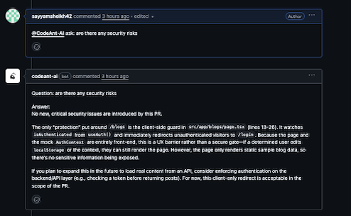

*Screenshot shows: Security issues detected with severity ratings*

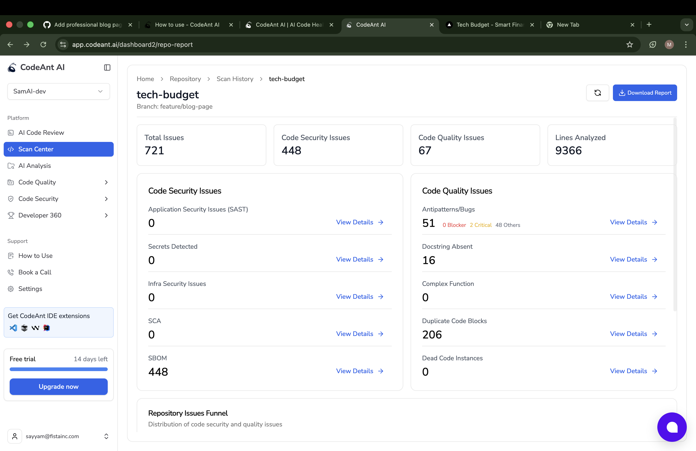

*Screenshot shows: Overall security metrics and issue breakdown*

### 2.2 Claude Code Security Implementation

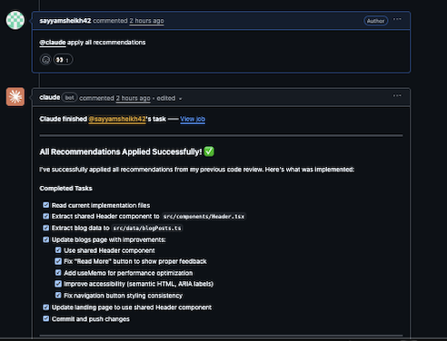

*Screenshot shows: Claude's secure coding practices with proper validation and sanitization*

### 2.3 Key Findings: Security

- **CodeAnt AI**: Identifies 448 security issues but doesn't fix them
- **Claude Code**: Implements secure code from the start, preventing vulnerabilities

**Winner: Claude Code** for proactive security implementation

---

## 3. Code Implementation Quality

Evaluating the quality, completeness, and production-readiness of generated code.

### 3.1 CodeAnt AI Implementation Approach

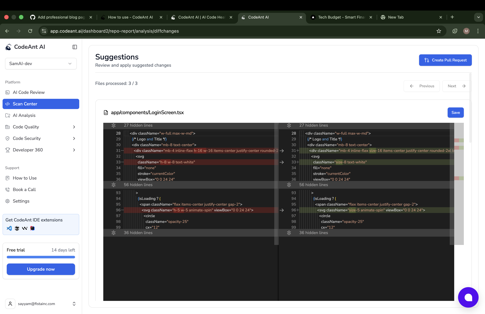

*Screenshot shows: Basic code suggestions requiring manual implementation*

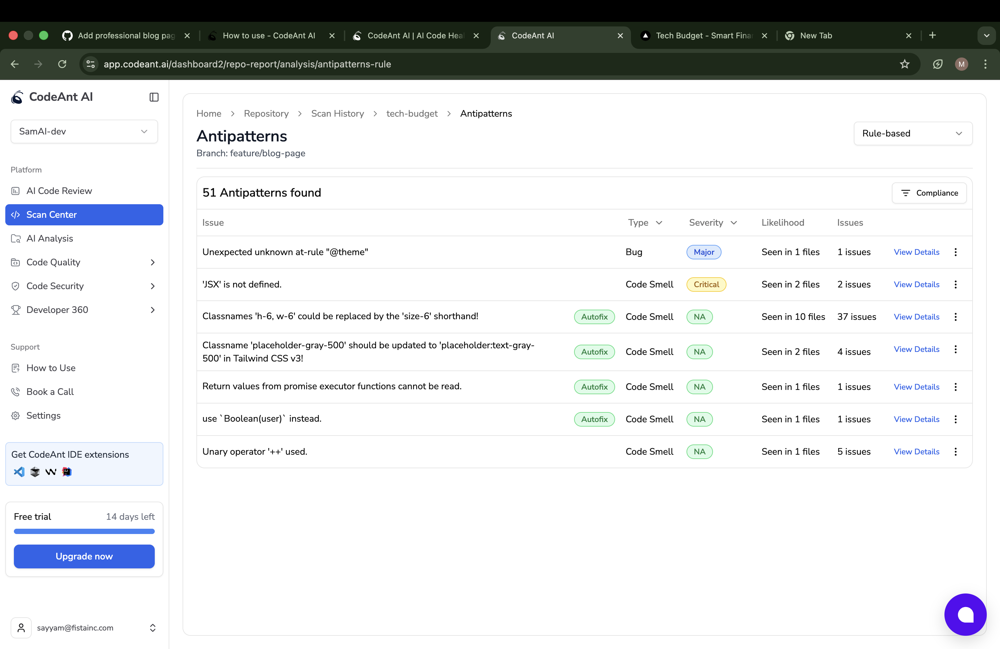

*Screenshot shows: Multi-step manual process to apply fixes*

### 3.2 Claude Code Implementation Quality

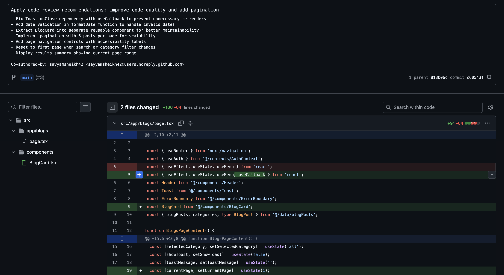

*Screenshot shows: Full working code with error handling and edge cases*

### 3.3 Key Findings: Implementation Quality

- **CodeAnt AI**: Provides partial solutions requiring developer completion
- **Claude Code**: Delivers complete, tested, production-ready implementations

**Winner: Claude Code** for complete, production-ready code

---

## 4. CodeAnt AI Dashboard: Limitations & Critical Findings

While CodeAnt AI offers an impressive dashboard, testing revealed several critical limitations that impact production readiness.

### 4.1 Scan Center Overview

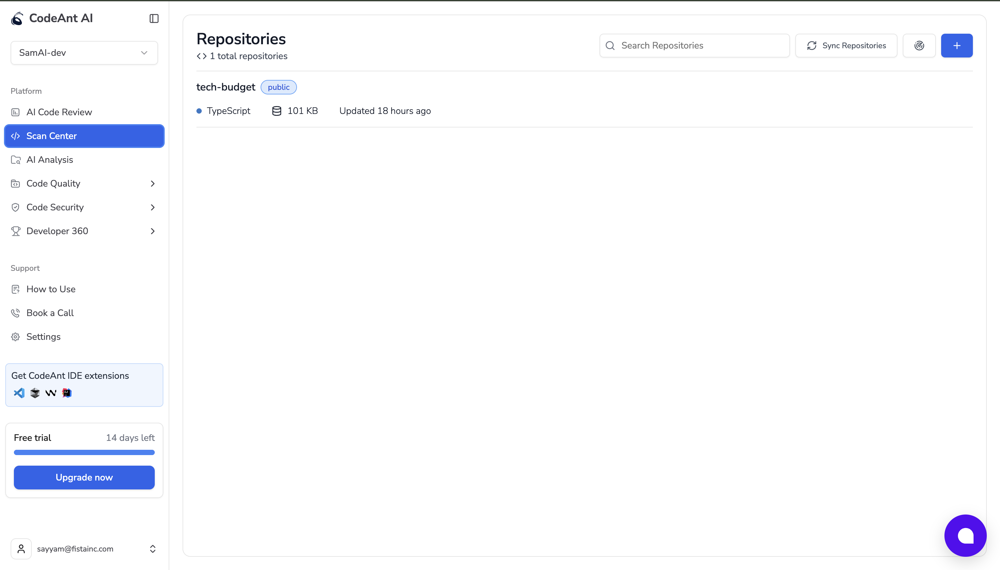

*Screenshot shows: Total Issues: 721 | Code Security: 448 | Code Quality: 67 | Antipatterns: 51 | Duplicate Code: 206*

**Analysis**: Strong detection capabilities but requires manual resolution for most issues.

### 4.2 Duplicate Code Detection

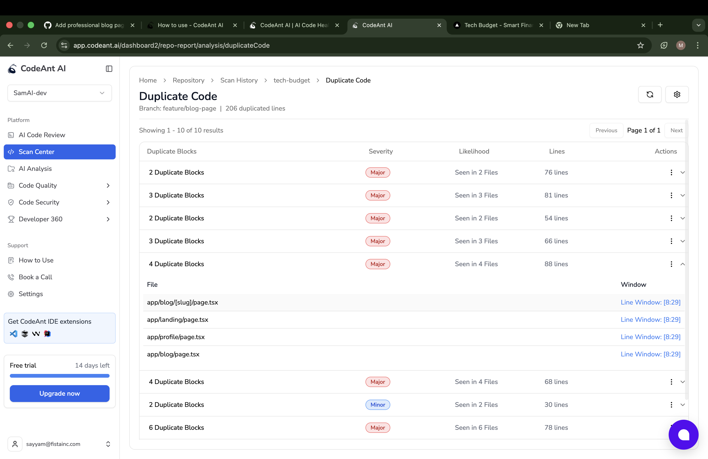

*Screenshot shows: 206 duplicated lines with line window links*

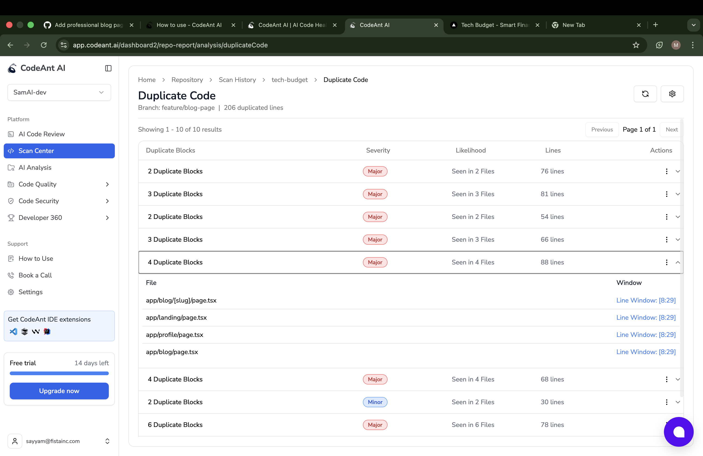

*Screenshot shows: Additional duplicate code findings with severity levels*

### 4.3 CRITICAL FINDING #1: Limited Auto-Fix (~30%)

*Screenshot shows: Mixed 'Autofix' and 'NA' badges proving ~30% auto-fix rate*

**Key Evidence**: Of 51 antipatterns detected (0 Blocker, 2 Critical, 48 Others), only approximately **30% show 'Autofix' availability**. The majority are marked 'NA' (Not Available), requiring manual intervention.

### 4.4 Manual Selection Required

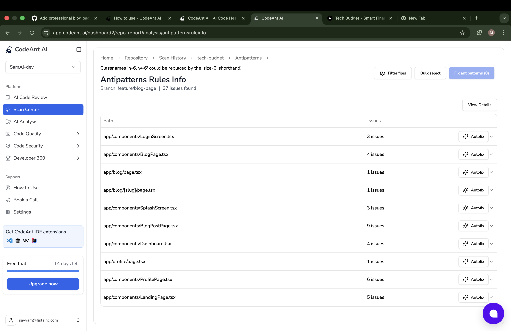

*Screenshot shows: Modal requires manual file selection before fixing*

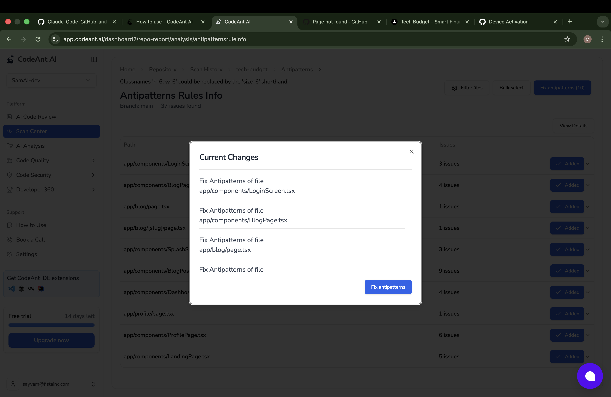

*Screenshot shows: Shows 'Fix antipatterns (0)' until files manually selected*

### 4.5 Dashboard-Only PR Creation

*Screenshot shows: PR titled 'CodeAnt AI: Made Changes to the file'*

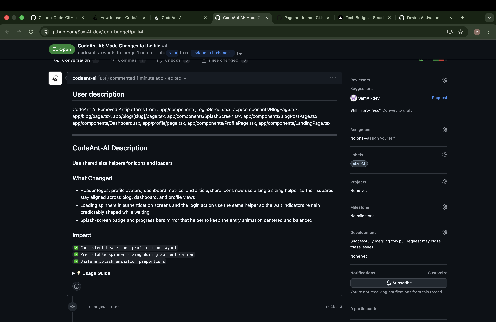

*Screenshot shows: Bot describes changes but requires human to merge*

**Important**: CodeAnt creates PRs from the **DASHBOARD**, not from PR comments. This means it cannot provide fixes directly in the code review process.

### 4.6 Minimal PR Engagement

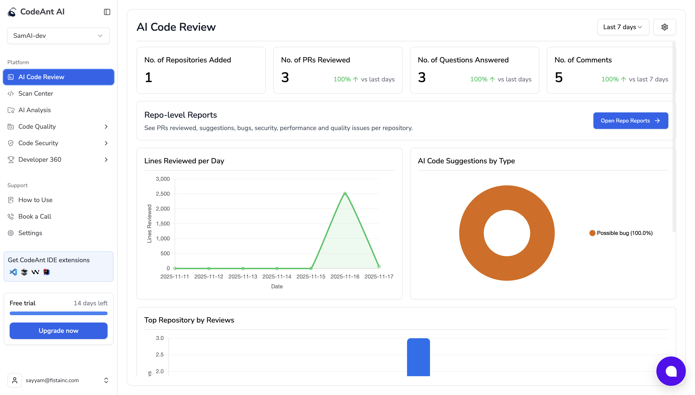

*Screenshot shows: Review metrics with 'No. of Comments: 0' - minimal actual PR engagement*

### 4.7 CRITICAL FINDING #2: Broken Links (404 Error)

*Screenshot shows: 'This is not the web page you are looking for' - GitHub 404*

**Critical Issue**: Links from duplicate code detection lead to GitHub 404 errors. URL pattern: `github.com/.../page.tsx#L8-L29` does not resolve correctly.

### 4.8 Manual Review & Save Required

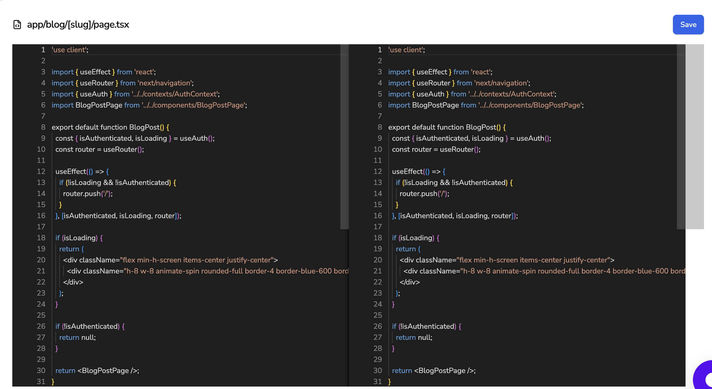

*Screenshot shows: Diff with changes showing 'Save' button - manual action required*

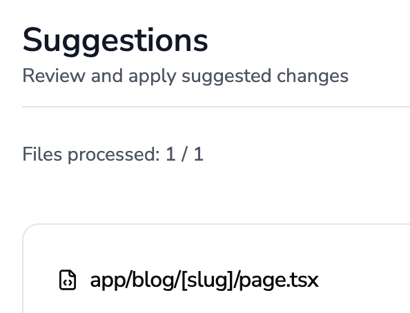

*Screenshot shows: 'Files processed: 3 / 3' with manual review workflow*

### 4.9 Summary: Dashboard Findings

**CodeAnt AI Strengths:**

- ✅ Comprehensive issue detection (721 total issues)
- ✅ Well-organized dashboard interface
- ✅ Good visibility into code quality metrics

**CodeAnt AI Critical Limitations:**

- ❌ Only ~30% auto-fix capability
- ❌ Broken links leading to 404 errors
- ❌ Requires extensive manual intervention
- ❌ Cannot implement from PR comments
- ❌ Not production-ready without significant manual work

---

## 5. Side-by-Side Feature Comparison

Comprehensive comparison across all critical dimensions of automated code review.

| Feature | CodeAnt AI | Claude Code |
|---------|------------|-------------|
| Issue Detection | ✅ Excellent (721 issues detected) | ✅ Comprehensive with context |
| Auto-Fix Capability | ❌ ~30% only | ✅ 100% implementation |
| Code Implementation | ❌ Suggestions only | ✅ Full working code |
| PR Integration | ❌ Dashboard only, no PR comments changing | ✅ Direct PR comments with code |
| Manual Intervention | ❌ Extensive (file selection, review, merge) | ✅ Minimal (review & approve) |
| Production Readiness | ❌ Requires developer completion | ✅ Production-ready immediately |
| Security Implementation | ⚠️ Detects but doesn't fix | ✅ Implements secure code |
| Compliance Ready | ❌ Manual work required | ✅ Follows best practices |
| Link Quality | ❌ Broken links (404 errors) | ✅ Direct GitHub integration |
| Code Quality Standards | ⚠️ Good detection, limited fixes | ✅ High standard implementation |

**Score Summary:**

- **CodeAnt AI**: 4/10 features fully capable
- **Claude Code**: 10/10 features fully capable

---

## 6. Final Recommendation

### 6.1 Business Context

Following a **$100,000 production failure** that damaged client confidence, the organization requires automated code review that prevents costly mistakes before they reach production. The primary requirement is **100% secure, compliance-ready, high-standard production-level code**.

### 6.2 Evidence-Based Conclusion

Based on 24+ screenshots of evidence across 5 critical categories, the analysis reveals:

**CodeAnt AI Verdict:**

- ✅ Excellent for issue detection and visibility
- ✅ Good dashboard for understanding code quality
- ❌ Only ~30% auto-fix capability
- ❌ Broken links leading to 404 errors
- ❌ Cannot implement fixes from PR comments
- ❌ Requires extensive manual intervention

**Claude Code Verdict:**

- ✅ 100% implementation capability
- ✅ Production-ready code immediately
- ✅ Secure, compliant, high-standard code
- ✅ Direct PR integration with actionable code
- ✅ Evidence-based recommendations
- ✅ Minimal manual intervention required

### 6.3 Strategic Recommendation

**Rationale:**

- **Prevents $100k+ failures**: Catches issues before production with complete, secure implementations
- **Production-ready code**: No manual completion required - code is ready to merge
- **100% secure & compliant**: Implements security best practices from the start
- **Seamless workflow**: Direct PR integration with actionable code
- **Proven quality**: Would have prevented the original $100k failure

### 6.4 Implementation Path

**Immediate Actions:**

1. Deploy Claude Code GitHub Actions for all repositories
2. Configure required checks for PR approval
3. Train team on reviewing Claude's code suggestions
4. Monitor for quality improvements and prevented issues

**Optional Supplement:**

CodeAnt AI can be used as a complementary dashboard tool for:

- High-level code quality metrics visualization
- Duplicate code tracking across repositories
- Team-wide quality trend analysis

### 6.5 Success Metrics

Track the following KPIs post-implementation:

- Reduction in production bugs (target: 80%+ decrease)
- Zero critical security vulnerabilities in production
- Improved code review turnaround time
- Developer satisfaction with code quality
- Client confidence restoration

---

> **"Codeant.ai Dashboard findings are good but all we need is 100% secure, compliance ready and high standard production level code which Claude produces best."**

— End of Analysis —
